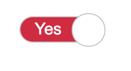

# Fun with CSS

Small exercices using pure CSS

## 0. Sprite languages
By using this HTML:

    <!DOCTYPE html>
    <html lang="en">
        <head>
            <meta charset="UTF-8" />
            <title>HBTN - 0- Sprite</title>

            <link href="0-styles.css" media="all" rel="stylesheet" type="text/css">
        </head>
        <body>
            <ul>
                <li>HTML</li>
                <li>CSS</li>
                <li>JavaScript</li>
            </ul>
        </body>
    </html>

And 0-sprite.png

Create `0-styles.css` and generate this layout:

You are not allowed to change the image and the HTML - _sprite is cool!_

## 1. Move the (under)line
By using this HTML:

    <!DOCTYPE html>
    <html lang="en">
        <head>
            <meta charset="UTF-8" />
            <title>HBTN - 1- Underline</title>

            <link href="1-styles.css" media="all" rel="stylesheet" type="text/css">
        </head>
        <body>
            <h2>
                Hello <a href="https://www.holbertonschool.com">Holberton!</a>
            </h2>
        </body>
    </html>

Create `1-styles.css` and generate this layout where the underline is hidden by default and appeared slowly…:

You are not allowed to change the HTML

## 2. Toggle
By using this HTML:

    <!DOCTYPE html>
    <html lang="en">
        <head>
            <meta charset="UTF-8" />
            <title>HBTN - 2- toggle</title>

            <link href="2-styles.css" media="all" rel="stylesheet" type="text/css">
        </head>
        <body>
            

                <input type="checkbox" name="toggle" class="toggle-cb" id="toggle-0" checked>
                <label class="toggle-label" for="toggle-0">
                    

                    

                </label>
            

        </body>
    </html>

Create `2-styles.css` and generate this layout where the `<input>` is has this custom toggle layout:

**Checked:**

**Unchecked:**

